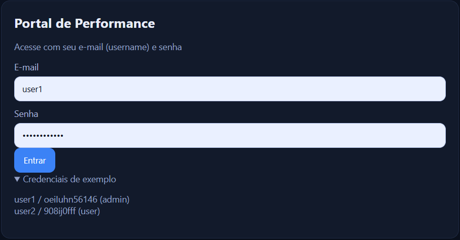
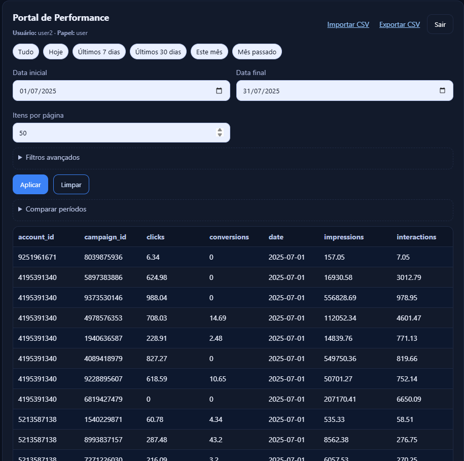
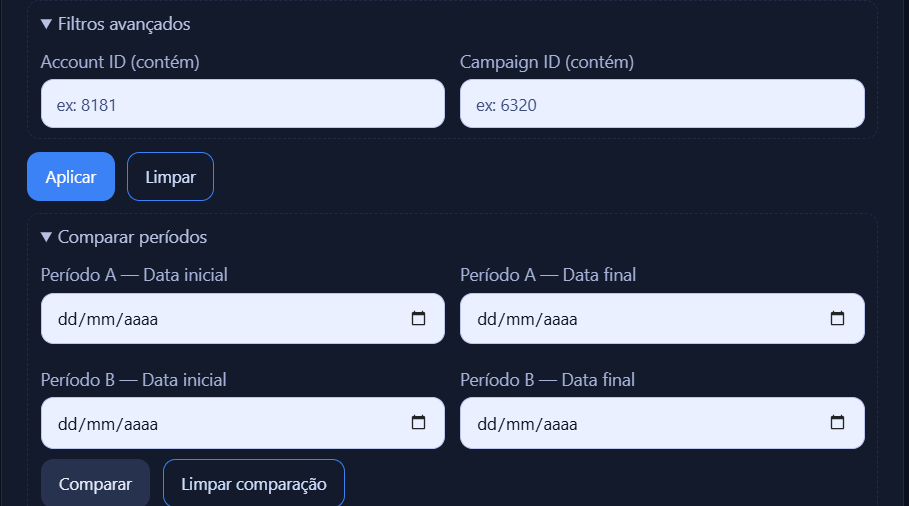
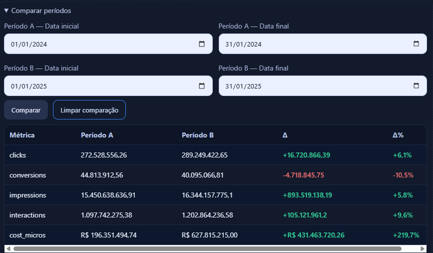
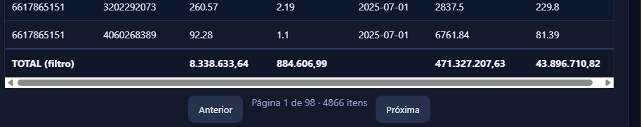
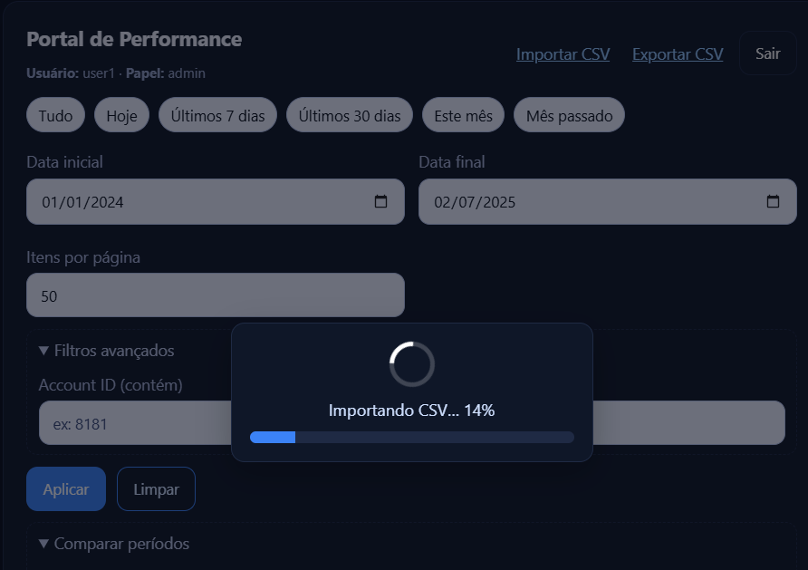

# Portal de Performance — Case Estágio Eng. de Software

Aplicação web para gestores de Marketing Digital visualizarem métricas de várias contas.  
**Stack:** Frontend (HTML/CSS/JS puros) · API em **Python/Flask** · Persistência em **SQLite** (gerada a partir do CSV).



---

## 🔎 Visão Geral

- **Login por e-mail/username e senha** (lido de `data/users.csv`).
- **Tabela** com paginação, **ordenação por qualquer coluna** e **totais no rodapé**.
- **Filtros** por data + atalhos (Hoje, Últimos 7/30 dias, Este mês, Mês passado) e por **Account/Campaign ID** (autocomplete).
- **RBAC**: a coluna **`cost_micros`** só aparece para **admin** (e entra no export/total apenas para admin).
- **Importar CSV** com **barra de progresso** (upload + processamento em chunks).
- **Exportar CSV** do filtro atual.
- **Comparar Períodos (A × B)** com deltas absolutos e percentuais.



---

## ✅ Conformidade com o Case

- **Frontend exibindo dados**: ✅ Tabela paginada com ordenação e filtros.
- **API servindo dados**: ✅ Flask + endpoints REST.
- **Login por e-mail/senha**: ✅ via `users.csv` (username/email + password + role).
- **Filtrar por data**: ✅ campos de data e chips rápidos.




- **Ordenar por qualquer coluna**: ✅ click no header (ASC/DESC).
- **`cost_micros` só para admin**: ✅ RBAC no servidor (dados não são enviados para “user”).
- **API em Python**: ✅ Flask + pandas + SQLite.

> Não requisitos: cadastro de usuário (não implementado, usei `users.csv`), frameworks no front (optamos por JS puro), UX/UI não avaliada (mas entreguei responsivo e legível).

---

## 🧱 Arquitetura
```plaintext
├── backend/
│   ├── __init__.py
│   ├── app.py
│   ├── auth.py
│   ├── data_loader.py
│   ├── import_csv_to_sqlite.py
│   └── utils.py
├── data/
│   ├── metrics.csv         # NÃO versionar
│   ├── metrics.db          # NÃO versionar
│   └── users.csv
├── docs/
│   └── img/
│       ├── 01-login.png
│       ├── 02-filtros.png
│       ├── 03-dashboard.png
│       ├── 04-comparacao.png
│       ├── 05-total.png
│       └── 06-progress.png
├── frontend/
│   ├── app.js
│   ├── index.html
│   └── styles.css
├── .gitignore
├── README.md
└── requirements.txt
```

Arquitetura (em 3 camadas)
[Frontend HTML/CSS/JS]
   - Tabela + filtros + ordenação + paginação
   - Importa CSV (upload com progresso) / Exporta CSV
   - Comparação de períodos (A × B)
           |
           v
[API Flask (Python)]
   - Auth (sessão com cookie)
   - /api/data, /api/export, /api/import*, /api/compare, /api/date-range, /api/options
   - Regras de negócio + RBAC (admin vs user)
           |
           v
[Dados: CSV -> SQLite]
   - Importo metrics.csv em chunks p/ tabela `metrics`
   - Índices: date, account_id, campaign_id
   - Export em streaming

**Decisões chave**
- **SQLite** com índices por `date`, `account_id`, `campaign_id` → consultas rápidas.
- **Ingestão em chunks** para CSVs grandes; limita variáveis do SQLite para evitar “too many SQL variables”.
- **RBAC no servidor**: segurança por omissão (coluna nem é selecionada para user).
- **Compress + CORS** no Flask para perf/integração.

---

## ▶️ Como rodar
Requisitos: Python 3.10+ e pip instalados
Eu usei Windows (Git Bash) durante o desenvolvimento.
```bash
# 1) criar venv + instalar deps
python -m venv .venv
source .venv/Scripts/activate  # (Windows Git Bash)
pip install -r requirements.txt

# 2) iniciar API
python backend/app.py
# abre http://127.0.0.1:8000

```
Credenciais de exemplo

user1 / oeiIuhn56146  (role: admin)
user2 / 908ij0fff     (role: user)

----
### Como usar (fluxo funcional)

Login → sessão criada por cookie.

A app carrega /api/date-range e pré-preenche as datas com min/max disponíveis.

Tabela: filtro por data, account/campaign (autocomplete), paginação e ordenação por qualquer coluna.

Totais no rodapé para o recorte atual (e em BRL para cost_micros quando admin).

Comparar períodos A×B: eu informo faixas ou deixo o app sugerir B e preencher A com janela equivalente; vejo Δ e Δ%.

Importar CSV: overlay exibe “Enviando…” → “Importando…” → “Finalizando…”; no fim, a tabela recarrega e aparece um toast de sucesso.

Exportar CSV: baixa o recorte atual, respeitando RBAC.
----

### Performance & Segurança (o que eu fiz)

Ingestão em chunks (pandas) para lidar com CSVs grandes sem estourar memória.

Limite do SQLite: quebro inserts para evitar “too many SQL variables”.

Índices por date, account_id, campaign_id aceleram filtros e ordenação.

Paginação + ordenação server-side → payload pequeno, rápido no cliente.

RBAC no backend: cost_micros só vai para admin (não aparece no JSON para user).

Compress + CORS: respostas menores; integração suave em ambiente local.
----

### Troubleshooting (erros clássicos que eu tratei)

Nada aparece ao aplicar filtros de data
→ Verifique se as datas existem no CSV (use os atalhos de período ou deixe a app carregar min/max por /api/date-range).

sqlite3.OperationalError: too many SQL variables
→ Resolvi limitando o tamanho do insert em data_loader.py (cálculo com SQLITE_MAX_VARS e rows_per_insert).

Pandas pedindo build tools no Windows
→ Usei versões estáveis no requirements.txt. Se usar Python novo, garanta pip atualizado (python -m pip install -U pip).

Git bloqueando push (arquivo grande)
→ Não versione data/metrics.csv e data/metrics.db. Veja .gitignore abaixo.
----
### Roadmap & Limitações (o que eu faria depois)

Cadastro/gestão de usuários, troca de senha, esqueceu a senha.

Permissões granulares além de admin/user.

Testes automatizados (unitários e integração).

Dockerfile/Compose.

Gráficos e insights (CTR, CPA, CPC, etc.).

Cache incremental para reimportações.

Internacionalização (i18n) e acessibilidade avançada (a11y).